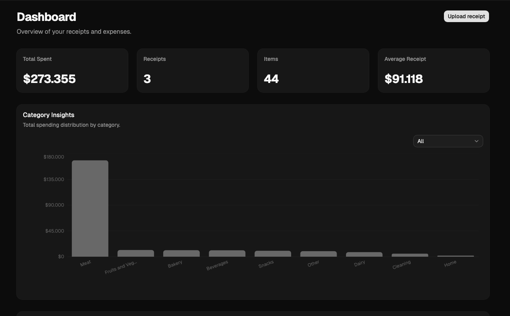
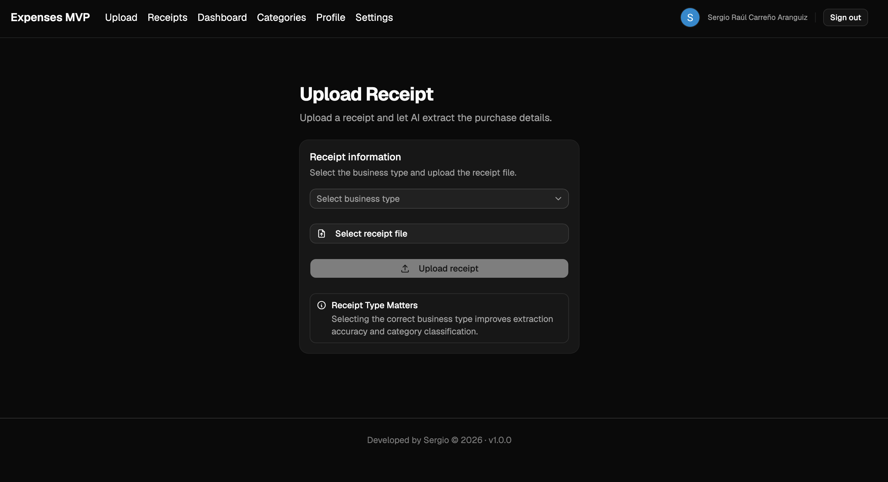
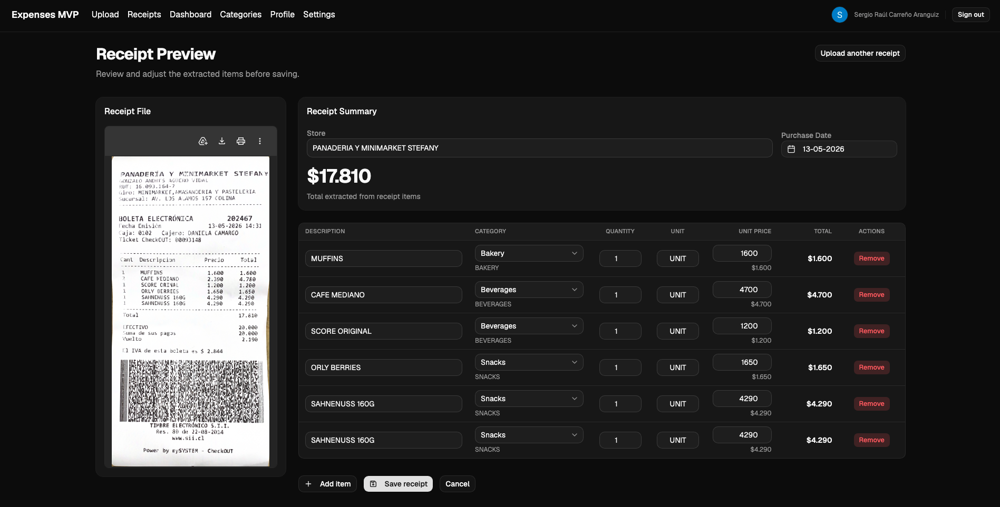
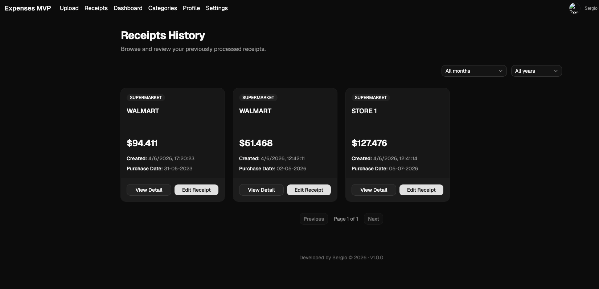
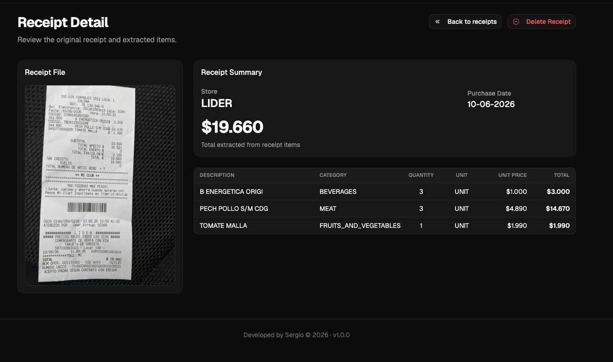
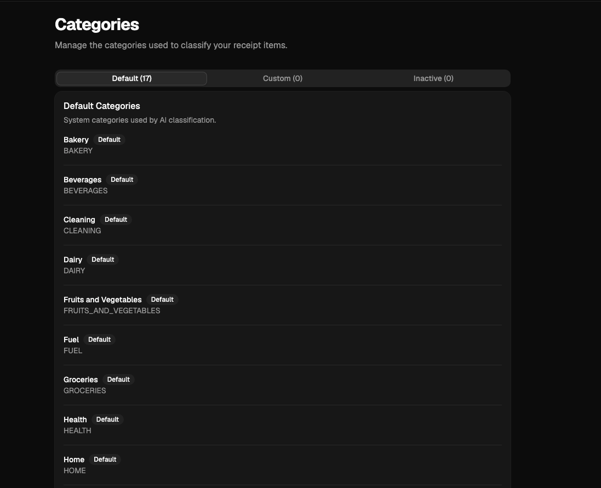
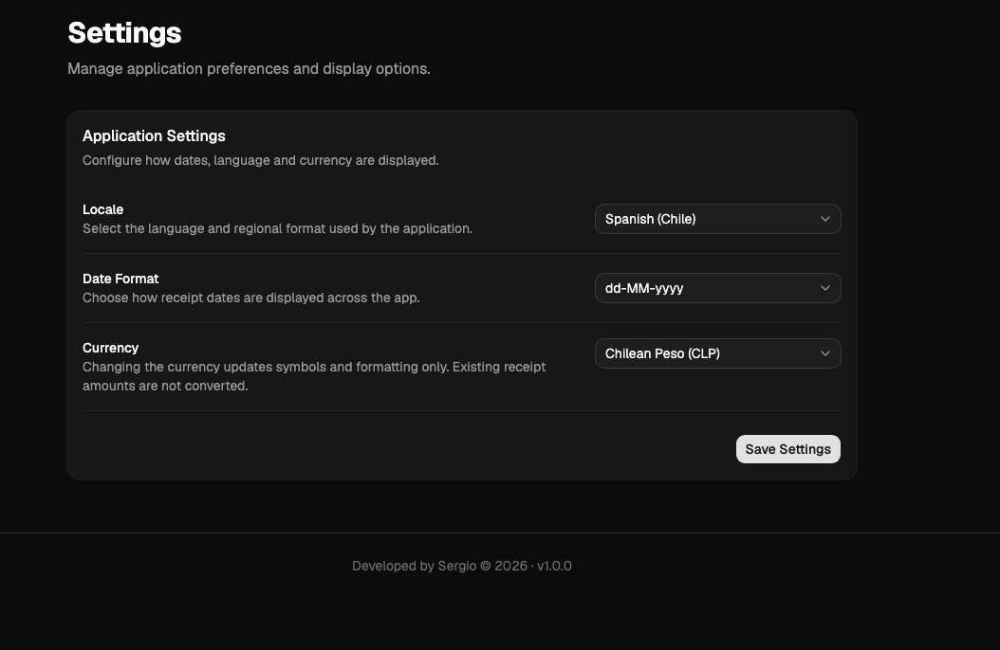

# Expenses v1.0.0

AI-powered household expense tracking application built with Next.js, Prisma, Neon PostgreSQL and OpenAI.

Expenses helps automate receipt processing by extracting purchase information from images and PDF receipts, allowing users to review, edit and categorize purchases before saving them.

The application also provides spending insights through dashboards and category-based analytics.

---

## Why I Built This

This project started as a personal tool to simplify household expense tracking while exploring AI-assisted document processing using OpenAI.

The goal was to build a complete end-to-end application covering:

* Authentication and user ownership
* File storage and management
* AI-powered receipt extraction
* Data validation and correction workflows
* Analytics and reporting
* Modern full-stack architecture using Next.js

---

## Screenshots

### Dashboard



### Upload Receipt



### Receipt Preview



### Receipt History



### Receipt Detail



### Categories



### Settings



---

## Features

### Authentication

* Google Authentication using NextAuth
* Protected routes
* User ownership and data isolation

### Receipt Processing

* Upload receipt images and PDF files
* AI-powered extraction using OpenAI
* Support for multiple business types
* Editable extraction preview before saving
* Automatic receipt item categorization
* Local and cloud file storage support

### Receipt Management

* Receipt history
* Receipt detail view
* Receipt editing
* Receipt deletion
* Pagination support

### Categories

* Default system categories
* Custom user categories
* Category activation and deactivation
* Manual category reassignment

### Dashboard

* Total spending summary
* Monthly expenses chart
* Spending by category
* User-specific analytics

### User Preferences

* Locale configuration
* Currency formatting
* Date formatting

---

## Technology Stack

### Frontend

* Next.js 15 (App Router)
* React
* TypeScript
* Tailwind CSS
* shadcn/ui

### Backend

* Next.js Route Handlers
* Prisma ORM
* Neon PostgreSQL

### AI

* OpenAI Responses API
* GPT-4.1 Mini

### Authentication

* NextAuth
* Google OAuth

### Storage

* Local File Storage (Development)
* Vercel Blob Storage (Production)

---

## Architecture

Receipt processing flow:

```text
Upload File
    ↓
Storage
    ↓
OpenAI Extraction
    ↓
Review & Edit
    ↓
Save Receipt
    ↓
Dashboard & Analytics
```

---

## Running Locally

### Prerequisites

* Node.js 22+
* PostgreSQL or Neon Database
* OpenAI API Key
* Google OAuth Credentials

### Installation

Clone the repository:

```bash
git clone <repository-url>
cd expenses-v2
```

Install dependencies:

```bash
pnpm install
```

---

### Environment Variables

Create a `.env` file in the project root:

```env
DATABASE_URL=

OPENAI_API_KEY=

AUTH_SECRET=

AUTH_GOOGLE_ID=
AUTH_GOOGLE_SECRET=

NEXT_PUBLIC_STORAGE_DRIVER=local
```

---

### Database Setup

Generate Prisma Client:

```bash
pnpm prisma generate
```

Apply existing migrations:

```bash
pnpm prisma migrate deploy
```

Optional:

```bash
pnpm prisma studio
```

---

### Creating New Migrations

After modifying:

```text
prisma/schema.prisma
```

Create and apply a migration:

```bash
pnpm prisma migrate dev --name describe_your_change
```

Regenerate Prisma Client:

```bash
pnpm prisma generate
```

Example:

```bash
pnpm prisma migrate dev --name add_receipt_status
pnpm prisma generate
```

---

### Development Reset

Only for local development:

```bash
pnpm prisma migrate reset
```

If working with a disposable database:

```bash
pnpm prisma db push
```

Do not use these commands in production environments.

---

### Start Development Server

```bash
pnpm dev
```

Open:

```text
http://localhost:3000
```

---

## Project Status

Current version:

```text
v1.0.0
```

This release includes:

* Google Authentication
* Multi-user support
* AI receipt extraction
* Receipt editing workflows
* Categories management
* Dashboard analytics
* User settings
* Local and cloud storage support
* Responsive UI

---

## Roadmap

Planned future improvements:

* Budget management
* Budget alerts
* Spending projections
* Household consumption analytics
* Product inflation tracking
* Purchase recommendations
* Advanced dashboard insights

---

## License

MIT
